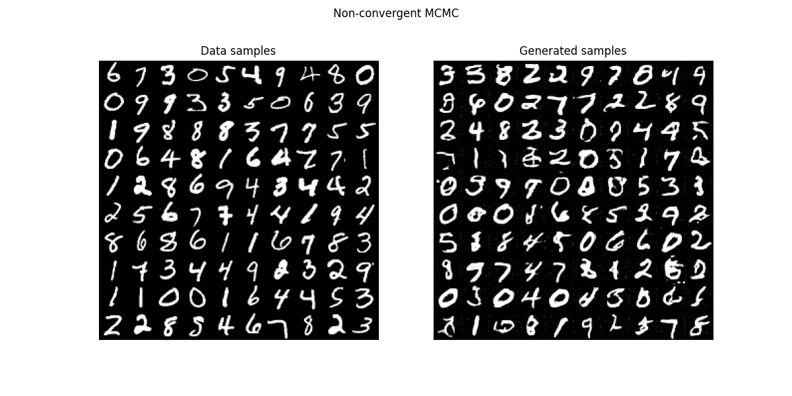

# Energy-based models with non-convergent MCMC

A JAX implementation of generative CNN energy-based models using non-convergent MCMC demonstrated on MNIST.

This implementation draws heavily on the suggestions of [Nijkamp et al. 2019](https://arxiv.org/abs/1903.12370). It is based on the [Flax](https://github.com/google/flax) library for deep learning and uses [tinymcmc](https://github.com/MatthewQuenneville/tinymcmc) for sampling.

